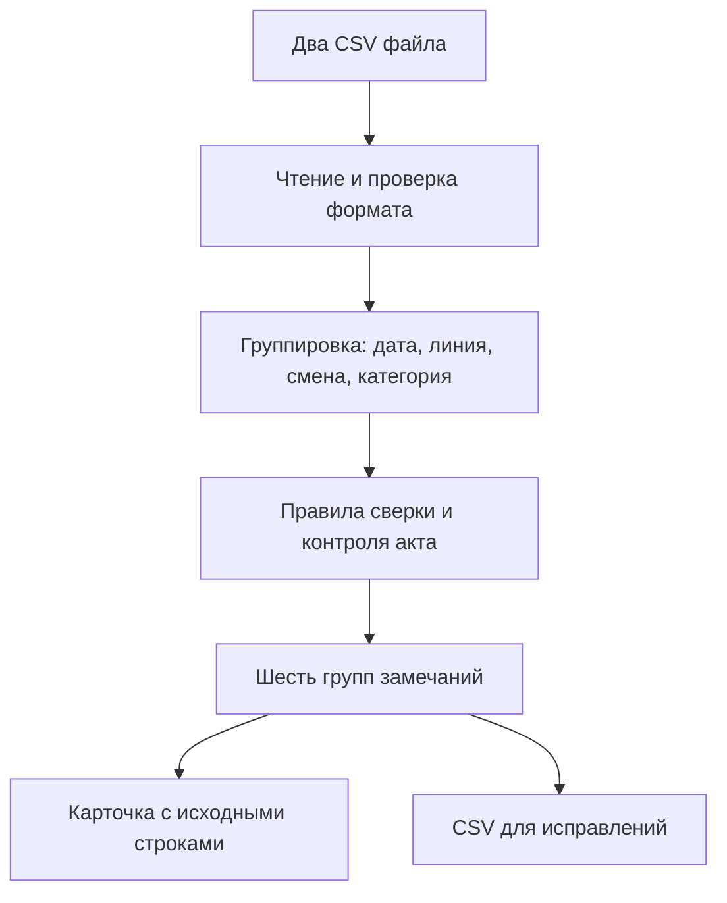

# OEE / Контроль простоев

Демонстрационный проект для собеседования: сверка строк OEE с актами простоев по линии, производственной дате и смене. Все примеры и названия в репозитории придуманы для демонстрации. Здесь нет файлов, снимков экрана, имён сотрудников, показателей или кода работодателя.

## Попробовать локально

Нужен Node.js 20 или новее. Установка зависимостей не требуется.

```bash
npm run dev
```

Откройте `http://127.0.0.1:4173` и нажмите **«Загрузить пример»**. Можно также загрузить свои CSV таблицы. Файлы обрабатываются в браузере и не отправляются на сервер.

```bash
npm test
```

## Что показывает демо

- Шесть групп замечаний: несовпадения минут, простои без актов, акты без OEE, ошибки категорий/полей акта, баланс смены за пределами допуска и спорные ночные смены.
- Фильтрацию по линии и периоду, поиск, пояснение причины, рекомендуемое действие и исходные строки с именем файла и номером строки.
- Выгрузку списка замечаний в CSV для Excel. Поля защищены от интерпретации как формулы при открытии в табличном редакторе.
- Отдельное правило для стандартных операций: отсутствие акта само по себе не замечание.
- Сравнение с **общим временем простоя** в акте, а не со временем ремонта.
- Базовую проверку самого акта: заполнены ли начало и конец, совпадает ли рассчитанная длительность с указанной.

Учебный набор `demo/` специально содержит по одному замечанию каждой группы. Например, акт указывает 50 минут простоя и 5 минут ремонта, а OEE — 42 минуты: разница равна 8 минутам.

## Формат входных CSV

Кодировка UTF-8, разделитель — запятая, заголовки на первой строке, дата в формате `YYYY-MM-DD`, время — `HH:MM`. Значения `shift`: `day`, `night`. Значения `category`: `mechanical`, `electrical`, `process`, `standard_wash`, `standard_other`. Примеры находятся в [`demo/oee.csv`](demo/oee.csv) и [`demo/acts.csv`](demo/acts.csv).

| OEE | Акт |
|---|---|
| `date,line,shift,master,category,minutes,accounted_minutes,note` | `date,line,shift,master,category,start,end,total_downtime_minutes,repair_minutes,reason` |

`accounted_minutes` — итог учтённого времени смены, одинаковый в строках одной смены. Учебная норма — 480 минут, начальный допуск — ±15 минут. Эти значения служат настройками **демо** и не описывают реальные цеха.

## Как устроено



Логика находится в `src/reconcile.js`, чтение CSV — в `src/csv.js`, интерфейс — в `src/app.js`. Тесты покрывают ключевые правила и учебный набор.

## Границы прототипа

Это самостоятельная учебная реализация, а не копия промышленной системы. Она принимает два CSV файла, работает без базы данных, учётных записей и интеграции с Power BI. Для спорных совпадений по другой категории требуется совпадение текста примечания с причиной акта; без него система оставляет отдельные замечания для ручной проверки. Ночная смена, пересекающая полночь, всегда требует подтверждения производственной даты. Показатели эффективности мастеров и их KPI здесь намеренно не рассчитываются: сначала нужны согласованные определения ошибок, ответственность за данные и проверка ложных срабатываний.

## Для собеседования

Проект показывает переход от ручной проверки к воспроизводимым правилам и проверяемым исходным строкам. Моя роль в кейсе: формулировка сценария, правил сверки, структуры замечаний и проверки на примерах; код демо создавался с помощью ИИ и проверялся тестами. Я не выдаю вымышленные показатели демо за фактический эффект внедрения. Краткий рассказ и вопросы — в [`docs/INTERVIEW.md`](docs/INTERVIEW.md).

## Конфиденциальность

Не публикуйте реальные отчёты, акты, логины, пароли и снимки рабочего интерфейса. `.gitignore` исключает типичные офисные файлы и каталоги `private/` и `uploads/`. Перед каждым коммитом проверяйте `git diff --cached`.

Лицензия: MIT для кода этого демонстрационного репозитория.
